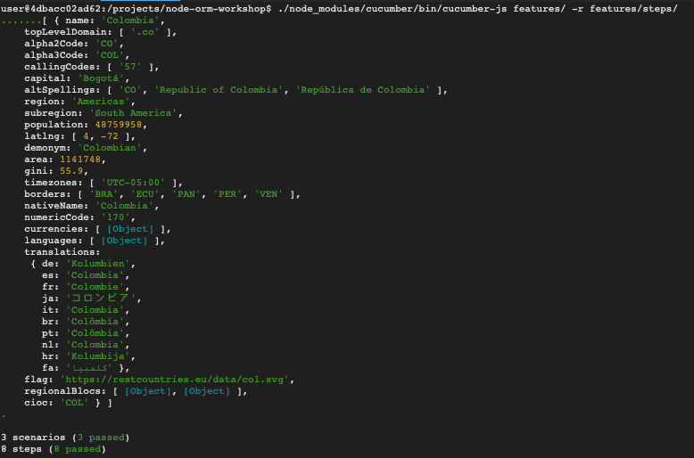

# node-orm-workshop-functional-testing
### Repositorio para el taller de node orm incluyendo pruebas funcionales con Gherkin y cucumber.js

Como primer paso, comenzamos definiendo nuestro feature:

Seguido de esto, dentro de la carpeta _steps_ debemos definir nuestros pasos:

Como último paso, se ejecutan las pruebas con el comando _./node_modules/cucumber/bin/cucumber-js features/ -r features/steps/_. El resultado debe ser el siguiente:

